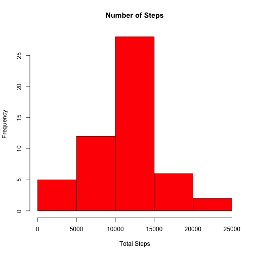
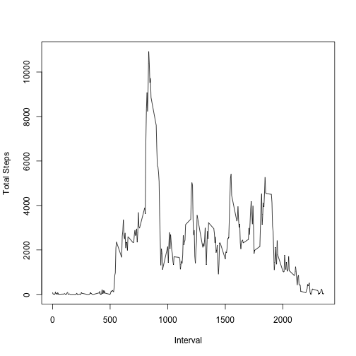
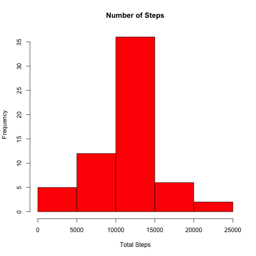
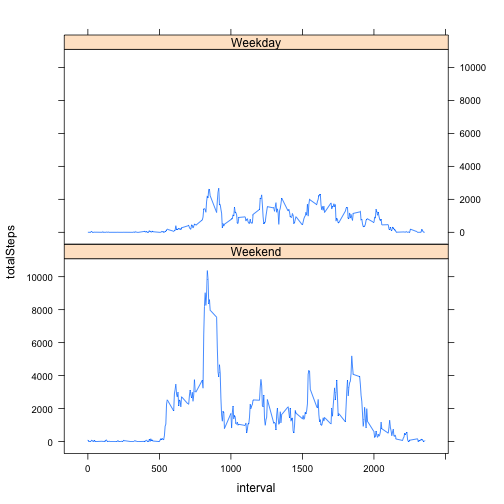

# Reproducible Research: Peer Assessment 1


## Loading and preprocessing the data
First let's read the data from the provided zip archive using _read.csv_ and _unz_ utility

```r
data <- read.csv(unz("activity.zip", "activity.csv"), header = TRUE)
```

Here is a sneakpeak of the dataset that we are dealing with

```r
str(data)
```

```
## 'data.frame':	17568 obs. of  3 variables:
##  $ steps   : int  NA NA NA NA NA NA NA NA NA NA ...
##  $ date    : Factor w/ 61 levels "2012-10-01","2012-10-02",..: 1 1 1 1 1 1 1 1 1 1 ...
##  $ interval: int  0 5 10 15 20 25 30 35 40 45 ...
```


Let's clean the dataset by ignoring NA values for now

```r
tidyData <- data[complete.cases(data$steps), ]
str(tidyData)
```

```
## 'data.frame':	15264 obs. of  3 variables:
##  $ steps   : int  0 0 0 0 0 0 0 0 0 0 ...
##  $ date    : Factor w/ 61 levels "2012-10-01","2012-10-02",..: 2 2 2 2 2 2 2 2 2 2 ...
##  $ interval: int  0 5 10 15 20 25 30 35 40 45 ...
```

After we have tidy dataset let's try to answer some of the following questions

## What is mean total number of steps taken per day?

Here is frequency histogram of total steps taken 

```r
totalSteps <- aggregate(tidyData$steps ~ tidyData$date, tidyData, sum)
colnames(totalSteps) <- c("date", "totalSteps")
hist(totalSteps$totalSteps, col = "red", xlab = "Total Steps", main = "Number of Steps")
```

 

The above dataset has a mean of 1.0766 &times; 10<sup>4</sup> and median 10765

## What is the average daily activity pattern?


```r
totalPerInterval <- aggregate(tidyData$steps ~ tidyData$interval, tidyData, 
    sum)
colnames(totalPerInterval) <- c("interval", "totalSteps")
plot(totalPerInterval$interval, totalPerInterval$totalSteps, type = "l", xlab = "Interval", 
    ylab = "Total Steps")
```

 


The maximum number of steps throughout all days is observed during the following interval

```r
totalPerInterval[which.max(totalPerInterval$totalSteps), ]
```

```
##     interval totalSteps
## 104      835      10927
```


## Imputing missing values
The above calculations omitted NAs for simplicity, but let's take a look at complete picture

```r
colSums(is.na(data))
```

```
##    steps     date interval 
##     2304        0        0
```


Since there is a considerable amount of missing data, let's imput missing values with average of that interval throughout the days. We will utilize plyr library for this purpose

```r
require(plyr)
```

```
## Loading required package: plyr
```

```r
impute.mean <- function(x) replace(x, is.na(x), mean(x, na.rm = TRUE))
# new data set with imputed values
fullData <- ddply(data, ~interval, transform, steps = impute.mean(steps))
```


Here is a histogram of the total number of steps taken each day after imputing missing values

```r
totalStepsFull <- aggregate(fullData$steps ~ fullData$date, fullData, sum)
colnames(totalStepsFull) <- c("date", "totalSteps")
hist(totalStepsFull$totalSteps, col = "red", xlab = "Total Steps", main = "Number of Steps")
```

 


The above dataset has a mean of 1.0766 &times; 10<sup>4</sup> and median 1.0766 &times; 10<sup>4</sup>
We can see that the mean of the dataset after imputing missing values remained the same and median has shifted to match the mean which is expected since we replaced `NAs` with average 

## Are there differences in activity patterns between weekdays and weekends?


```r
require(lattice)
```

```
## Loading required package: lattice
```

```r
fullData$date <- as.Date(fullData$date)
dayType <- weekdays(fullData$date) == "Sunday" | weekdays(fullData$date) == 
    "Saturday"
fullData$dayType <- factor(dayType, labels = c("Weekend", "Weekday"))
totalStepsByDayType <- ddply(fullData, .(dayType, interval), summarize, totalSteps = sum(steps))
xyplot(totalSteps ~ interval | dayType, data = totalStepsByDayType, layout = c(1, 
    2), type = "l")
```

 


